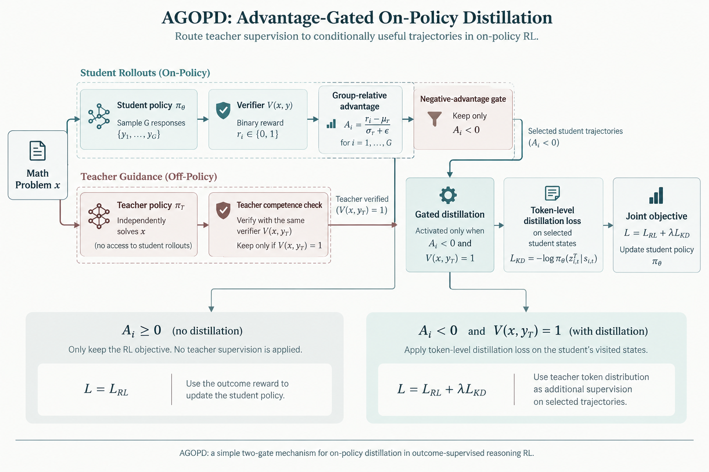
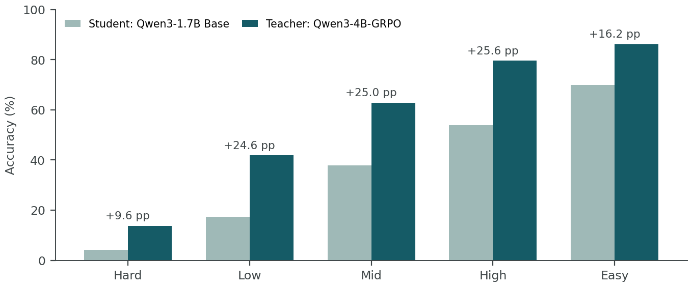
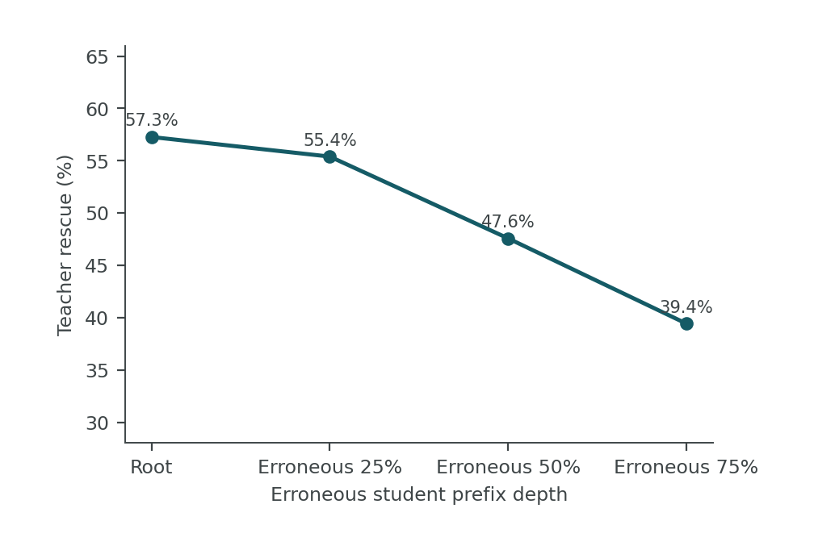
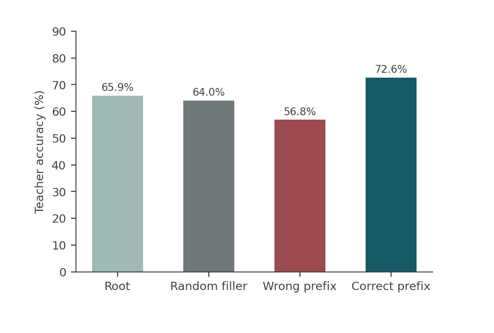
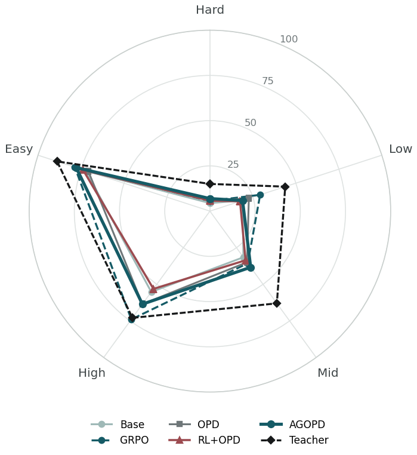
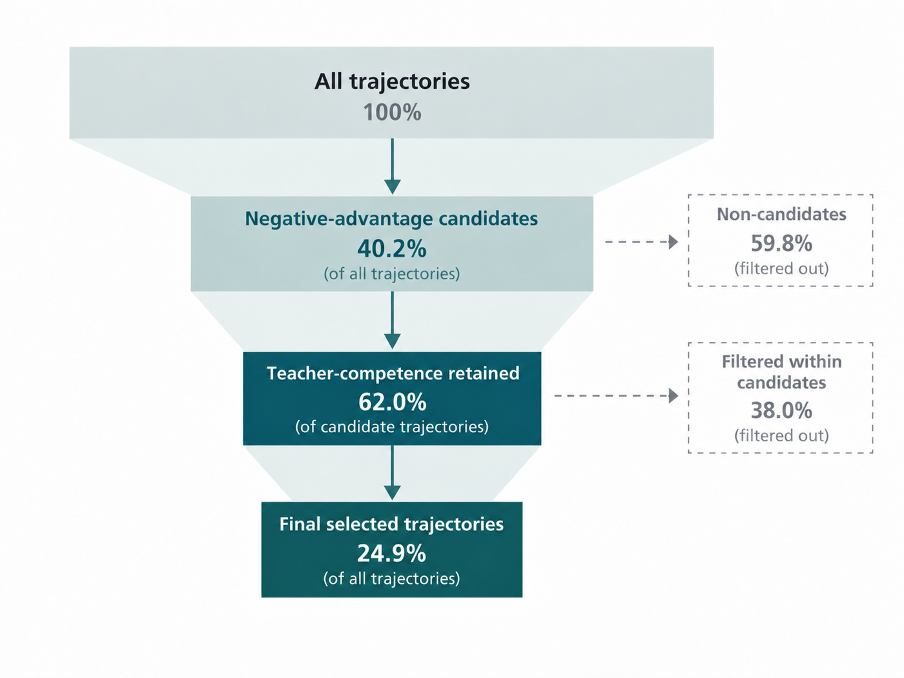
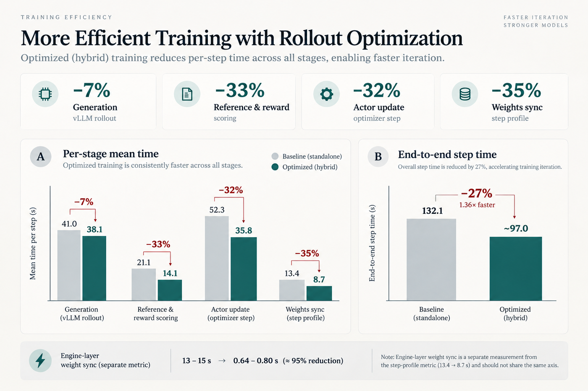

# AGOPD-RL

面向小模型数学推理的**在线策略蒸馏(OPD)** 研究代码库:用受控实验说明"教师词元级监督什么时候有用、什么时候有害",并给出可复现的门控方案。

[](https://www.python.org/)
[](https://github.com/volcengine/verl)
[](https://github.com/vllm-project/vllm)
[](https://arxiv.org/abs/2106.09685)
[](LICENSE)
[](https://arxiv.org/abs/2402.03300)
[](https://arxiv.org/abs/2306.13649)
[](#主要结果)
[](https://arxiv.org/abs/2501.12948)
[](#硬件与拓扑)

> 本仓库只包含代码、研究与研究报告材料,**不含模型权重与训练数据**;所有发布文件已去除云端主机、凭据与个人路径。

## 📄 研究报告(中英双版 · 45 页)

| 版本 | 语言 | 页数 | HTML（自包含，可离线） | PDF |
|---|---|---:|---|---|
| AGOPD v6.0 · restructured | 中文 | 45 | [`….html`](reports/AGOPD_paper_v6_0_restructured_20260908.html) | [`….pdf`](reports/AGOPD_paper_v6_0_restructured_20260908.pdf) |
| AGOPD v6.0 · restructured | English | 59 | [`…_en.html`](reports/AGOPD_paper_v6_0_restructured_20260908_en.html) | [`…_en.pdf`](reports/AGOPD_paper_v6_0_restructured_20260908_en.pdf) |

(图表以 data-URI 内嵌,单文件即可离线阅读),覆盖:负迁移机制诊断 → 受控四臂对照 → 状态级可恢复性探针 → 跨规模验证与工程附录。
> 仓库同时提供 `src/`、`scripts/`、`patches/` 与 `reports/figures/`,可对照研究报告逐节复现。



*图 3 · AGOPD 方法结构。负优势门在轨迹级选择相对劣势的学生轨迹;教师胜任门在题目级要求教师模型独立求解并通过同一结果验证器;只有同时通过两级门控的学生访问状态获得非零蒸馏权重。*

## 这个项目解决什么问题

在线策略蒸馏让学生在自己的轨迹上接受教师逐词元监督,常被当作"免费的密集信号"。但在小模型 + 结果奖励 RL 的组合里,它经常**不是零收益,而是负收益**:

- 学生答对的轨迹上也被施加蒸馏,会把正确行为改回教师分布;
- 教师本身可能**弱于**训后学生:是否占优要按**状态**判断,而不是看平均分;
- 无条件、固定系数的蒸馏项会主导梯度,把 RL 变成"对教师做 SFT";
- 后果通常表现为:策略熵下降、回答变长、答案解析率下降、固定评估变差。

本仓库提供**同数据、同通道、同评估**的受控实验脚手架,用于回答:负迁移从何而来,什么样的门控/目标/调度能把它收回来。

## 方法流水线

```
题目 x
  -> 学生策略 πθ 采样 n 条轨迹                        (vLLM, no-think, 2048)
  -> 规则验证器给出结果奖励                          (strict / semantic)
  -> GRPO 组内相对优势 A_i
  -> [ 优势门 ]  仅 A_i < 0(负优势)轨迹进入候选       (AGOPD)
  -> [ 教师胜任门 ] 教师先解题,仅"教师答对"的题可蒸    (AGOPD)
  -> 词元级监督:hard-CE / top-k 正向 KL / 反向 KL     (可切换)
  -> 系数调度:warmup -> 平台 -> anneal                (SAF-OPD 式)
  -> 合并损失 L = L_GRPO + β·L_KL + c(step)·L_distill
```

## 主要结果

### 1.7B：四臂受控对照（固定 1,024 题，strict）

| 方法 | Correct / 1024 | Accuracy | Δ vs GRPO |
|---|---:|---:|---:|
| Base | 239 | 23.34% | −5.08pp |
| GRPO | 291 | 28.42% | — |
| OPD（纯蒸馏） | 263 | 25.68% | −2.73pp |
| **RL + OPD（无条件）** | 247 | **24.12%** | **−4.30pp** |
| AGOPD（优势门 + 教师胜任门） | 277 | 27.05% | −1.37pp |

结论:无条件 RL+OPD 显著拖累;门控收回大部分损失,但未超越纯 GRPO。

## 研究报告简版（要点与关键图）

**摘要.** 在线策略蒸馏(OPD)把教师分布当作学生自生成轨迹上的稠密监督，常被视为"免费的密集信号"；但在小模型 + 结果奖励 RL 的组合里，它往往不是零收益，而是**负收益**。本研究报告给出可复现的因果证据链：先用 1.7B 学生的受控四臂实验确认"无条件 RL+OPD 相对纯 GRPO 显著退化"（固定 1,024 题、逐题配对检验）；再把退化拆成五个**可证伪假设**，以"错误前缀深度 × 等长对照"把**上下文长度**与**错误语义**分离，并以**门控消融**提供单变量因果证据；最后落到方法——**只在"负优势轨迹 ∩ 教师可解题目"处施加蒸馏**（AGOPD 两级门控），并给出 4×A100 上的训练/推理拓扑与引擎参数优化。报告亦明确边界：门控能收回大部分退化，但在该设定下**并未超越纯结果监督 RL**。

### 图 2 · 教师监督：从题目级能力到状态级可恢复性

<table><tr>
<td></td>
<td></td>
<td></td>
</tr></table>

*教师在**题目根状态**上于各能力区间保持优势；(b) 随**学生错误前缀加深**，教师救援率持续下降；(c) **长度匹配对照**显示：错误前缀低于等长随机填充，而正确前缀高于错误前缀——决定可恢复性的是前缀的**推理语义**，不是长度。*

### 图 4 · 难度分层能力轮廓（雷达）



*五条半径对应按 Base 学生能力估计划分的五个区间(Hard→Easy)；门控方法的恢复在难度轴上**非均匀**，固定教师轮廓在多数区间位于最外层。*

### 图 5 · 门控动态与蒸馏作用域



*负优势门平均放行约 **40%** 轨迹进入候选，教师胜任门再保留其中约 **62%**，使平均蒸馏损失降到无条件 OPD 的约五分之一，而两者策略熵几乎相同。*

### 图 J1 · rollout 拓扑优化前后的耗时对比（工程附录）



*3+1 混合拓扑 + sleep-mode 增量同步：逐步权重同步由 **13–15s → 0.64–0.80s(−95%)**，端到端单步 **132.1s → ~97s(−27%)**，actor 更新 **52.3s → 35.8s**。*

> 以上为**简版**;完整的机制推导、附录（数据/协议/统计口径/工程附录）见上面链接的中英双版研究报告。

## 负迁移的假设与验证链

负迁移不是一句结论,而是一组**相互竞争的解释 + 逐条证伪实验**:

| # | 假设 | 验证方式（方法） |
|---|---|---|
| H1 | 教师绝对能力不足 | 题目**根状态**同题重测 + 能力分桶看教师优势 |
| H2 | **状态错位**（主假设）：监督施加在学生已错的中间状态 | 错误前缀按 25/50/75/100% 截断后交给教师续写；加**等长随机填充**与**等长正确前缀**对照，把"长度"从"语义"里分离 |
| H3 | 监督粒度错配（轨迹级 vs 状态级） | 同题配对的 RFT（轨迹级）与 OPD（状态级）受控对照 |
| H4 | 作用域过宽（无条件施加） | **门控消融**：优势门 / 教师胜任门 / 两者联合，其余配置不变 |
| H5 | 固定教师弱于训后学生 | 教师**真实轨迹**探针（同题同协议独立生成）+ 蒸馏时教师胜任比例 |

证据分层:前缀深度与同题能力对比给出**相关**;等长填充与同题配对**剥离混杂**;门控消融只改"监督施加在哪些状态"这一个变量,给出**因果**。

完整协议、判据与入口脚本见 **[`docs/mechanism-verification.md`](docs/mechanism-verification.md)**。

## 何时该用 OPD（工程结论）

| 门槛 | 判据 |
|---|---|
| 教师**逐状态**更强 | 同状态下教师把概率推向成功 token;仅"学生答错"的轨迹上与理想梯度对齐 |
| 教师有**新能力** | 同族、同配方放大规模通常无新能力;教师间能力差 16.7 分,学生只差 0.1 分 |
| 题目按**教师对齐**选 | 按教师困惑度/对齐度选题,而非学生舒适区 |
| 熵/多样性有余量 | 硬 argmax 会把熵压没;高熵 token 需要保留 |

**任一条不满足 → 不要无条件开 OPD**;应改为门控(优势门 + 教师胜任门)、软目标(反向 KL / tail-aware top-k)、系数 warmup→anneal,或干脆先不用。

## 训练配置与硬件配置（摘要）

### 硬件与拓扑

| 环境 | 配置 | 约束 |
|---|---|---|
| 云端（主实验） | **4 × A100 80GB**；3+1 混合：学生 FSDP 训练 + 同卡 rollout 占 3 卡，教师独占 1 卡 | 教师用 **TP1 × 数据并行**（长生成吞吐受并发约束 > 单请求延迟） |
| 本地（探索/调试） | 2 × RTX 4090 24GB | 8B 级模型需 `gpu_memory_utilization ≤ 0.85`、`max_num_batched_tokens ≤ 8192`；该卡型多卡 FSDP 存在 NCCL P2P 限制 → 默认单卡 |

### 训练配方

| 项 | 1.7B 全参数 | 4B LoRA |
|---|---|---|
| 优化通道 | full-param | **LoRA `r=16` + `lr=1e-4`** |
| KL 系数 | `0.05` | `0.05` |
| batch / mini-batch | `8 / 4` | `12 / 6` |
| rollout 组大小 | `6` | `4` |
| 序列预算 | prompt 1024 + response 2048 | 同左（`max_model_len 3073`） |
| 采样可比性 | `data.seed=42` | `data.seed=42` |

引擎/拓扑开关:`rollout.nnodes=0`（actor/rollout 同卡混合）、`enable_sleep_mode=True`、`free_cache_engine=True`、`max_num_batched_tokens=16384`、`rollout.agent.num_workers=16`、`enforce_eager=False`。

OPD 相关开关:`hard_ce` / `reverse_kl` / `temperature`（目标形式）、`coef_schedule=warmup_anneal`（系数调度）、`teacher_after_advantage` + `advantage_gate` + `teacher_gate`（作用域门控）。

完整版本钉扎、数据划分、评估协议与运行纪律见 **[`docs/training-configuration.md`](docs/training-configuration.md)**。

## 仓库结构

```
agopd-rl/
├── src/agopd/            # 核心包:gating(优势门/教师胜任门)、reward、data
├── scripts/              # 训练 wrapper、普查、评估、分析与探针脚本
│   ├── run_4b8b_verify.sh          # 参数化多卡 RL / OPD 启动器
│   ├── run_grpo_vanilla_opd.sh     # verl OPD 训练入口(参数化)
│   ├── evaluate_dapo_vllm.py       # 固定 1,024 评估(direct-LoRA)
│   ├── census_scale.py             # 跨规模能力普查(n=8)
│   └── analyze_4b8b_verify.py      # 两臂逐题配对 Δ / 95% CI / McNemar
├── configs/              # 环境与运行配置
├── patches/              # 针对 verl 的补丁(standalone rollout、padded logprob 等)
├── docs/                 # 方法与设计说明(实验运行日志不在开源范围)
├── reports/              # 研究报告(中英双版 HTML/PDF)、图表、评估汇总 JSON
├── pyproject.toml
└── LICENSE
```

## 快速开始

```bash
# 1) 环境(示例:conda + 官方 vLLM/verl 轮子)
pip install -e ".[dev]"
pip install -e ".[train]"        # ray / tensordict / peft / tensorboard 等

# 2) 准备 verl 并应用补丁(训练必需)
git clone https://github.com/volcengine/verl && git checkout v0.8.0
for p in patches/verl-v0.8.0-*.patch; do git -C verl apply "../$p"; done

# 3) 跨规模能力普查(每模型一张卡)
python scripts/census_scale.py --model ${AGOPD_ROOT}/models/Qwen3-4B \
    --train-file data/dapo-verl-v1/train.parquet --n 8 --max-prompts 16164 \
    --shard-idx 0 --n-shards 4 --out outputs/census_4b_full

# 4) 训练一臂(纯 GRPO 示例;门控/软目标/系数调度由 ARM 与超参控制)
ARM=A TRAIN_STEPS=160 bash scripts/run_4b8b_verify.sh

# 5) 合并 FSDP 检查点并做固定 1,024 评估(direct-LoRA)
python -m verl.model_merger merge --backend fsdp \
    --local_dir ${AGOPD_ROOT}/checkpoints/agopd-rl/<run>/global_step_160/actor \
    --target_dir ${AGOPD_ROOT}/models/<run>160
python scripts/evaluate_dapo_vllm.py --model ${AGOPD_ROOT}/models/Qwen3-4B \
    --lora-adapter ${AGOPD_ROOT}/models/<run>160/lora_adapter --lora-rank 16 \
    --data data/dapo-verl-v1/val_shards/val_s0.parquet \
    --output reports/eval-dapo-v1/<run>_s0.jsonl --max-new-tokens 2048 --seed 42
python scripts/analyze_4b8b_verify.py --a-pattern <A>_s?.jsonl --b-pattern <B>_s?.jsonl
```

## 复现要点

- **数据可比性**:所有需要比较的实验显式传 `data.seed=42`(verl 默认不播种采样序列)。
- **固定评估**:`data/dapo-verl-v1/val.parquet`(1,024 题),非思考模式、`max_new_tokens=2048`、`temperature 0.6 / top_p 0.95 / top_k 20`、`seed 42`,strict 与 semantic 双口径。
- **训练通道**:LoRA `r16 + lr=1e-4`(过窄的 r8 + lr1e-6 通道不适用于该底座)。
- **拓扑**:3+1 混合(学生 FSDP + 同卡 rollout 复用 3 卡,教师 1 卡),`rollout.nnodes=0`。
- **评估口径**:LoRA 检查点必须经 `--lora-adapter` 直接评估;直接评合并目录会退化为 Base。

## 许可

Apache-2.0,见 [LICENSE](LICENSE)。
